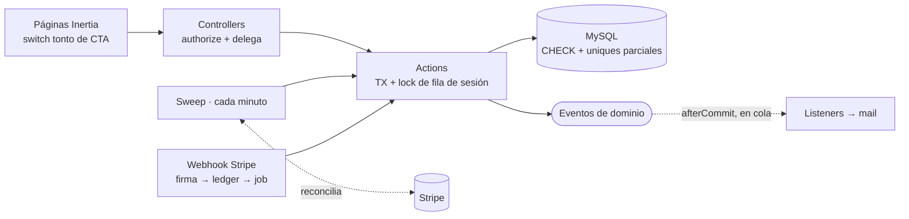
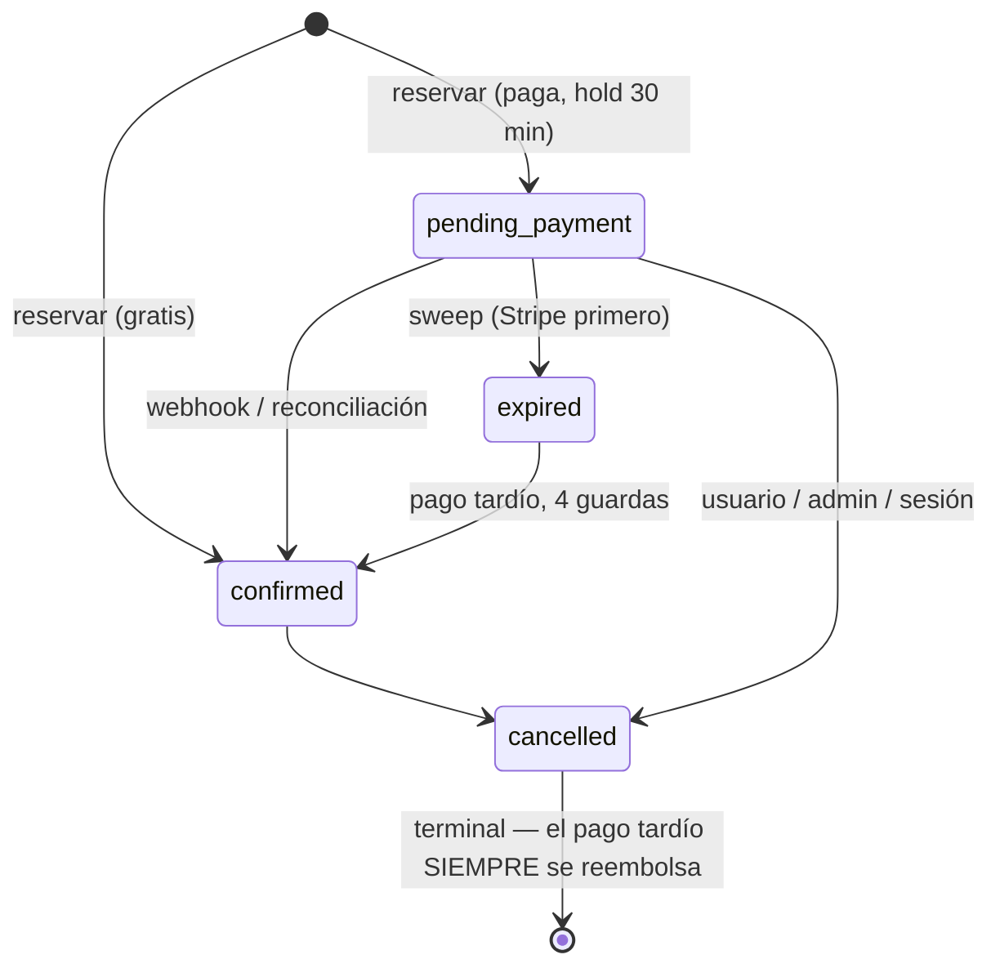

# Class Booking Platform — Laravel + Inertia + Vue

[](https://github.com/haefrain/class-booking-platform/actions/workflows/ci.yml)
[](LICENSE)


🇬🇧 [English version](README.md)

Una plataforma full-stack de reservas de clases para un estudio/academia — clases grupales recurrentes con cupos limitados — construida para mostrar cómo un código senior de Laravel + Inertia resuelve las partes del dominio de reservas que de verdad duelen: **concurrencia de cupos sin overbooking, waitlist FIFO con promoción atómica, pagos Stripe que sobreviven todas las carreras, recurrencia a prueba de DST y recordatorios en cola que disparan como máximo una vez.** Todo bajo Pest, una suite de concurrencia con locks reales, Larastan nivel 7, vue-tsc y CI contra MySQL real.

## Stack

- **Laravel 13**, PHP 8.4 + **Inertia 3 / Vue 3 / TypeScript / Tailwind 4** (starter kit oficial, rutas tipadas con Wayfinder)
- **MySQL 8** · **Redis** (colas/caché) · **Mailpit** (mail dev) · **Stripe Checkout** (modo test, detrás de un puerto de gateway)
- **Calidad:** Pest (+ suite dedicada de concurrencia con dos conexiones), Larastan L7, Pint, ESLint/Prettier, Vitest, GitHub Actions

## Las invariantes — y los tests que las prueban

El motor de cupos se define por ocho invariantes, aplicadas en tres capas (actions bajo un lock de fila → constraints de DB → un auditor en runtime conectado a `afterEach` y al `integrity:check` horario). Un revisor puede ir directo con grep a la prueba:

| # | Invariante | Probada por |
|---|---|---|
| I1 | `booked_count ≤ capacity`, siempre | `fires the database backstops even without the lock` (CHECK, errno 3819) |
| I2 | `booked_count` = reservas vivas, sin deriva | `SeatInvariantAuditor` en afterEach de cada test de booking/pagos/concurrencia |
| I3 | ≤ 1 reserva activa por usuario/sesión | `refuses a second active booking` + backstop de columna generada |
| I4 | Nunca con cupo Y en espera a la vez | auditor + `converts a waiting entry to left when the user books…` |
| I5 | Promociones estrictamente FIFO | `promotes a chain of cancellations strictly FIFO` |
| I6 | Alguien esperando ⇒ sesión llena | `never shows the seat free to a direct booker while a waiter is being promoted` |
| I7 | Deadline presente ⟺ pago pendiente | auditor + `confirms the booking when the completed webhook arrives` |
| I8 | Máximo un refund por pago | `refunds exactly once under double dispatch thanks to the atomic claim` |

La suite de concurrencia (`tests/Concurrency/`) usa **una segunda conexión MySQL** y `FOR UPDATE NOWAIT` para probar que el lock de la fila de sesión se sostiene de verdad — más una prueba de propiedad de 50 operaciones intercaladas verificando todas las invariantes tras cada paso. Corre en CI contra el service container de MySQL.

## Arquitectura





Decisiones clave (cada una es un [ADR](docs/adr/)):

- **Un solo punto de serialización** — cada mutación de cupos bloquea la fila de la sesión; orden de locks fijo; cero I/O de red dentro de transacciones ([0001](docs/adr/0001-single-session-row-lock.md)).
- **Promoción dentro de la transacción que libera** — un cupo liberado nunca es observablemente libre si alguien espera ([0002](docs/adr/0002-promotion-inside-the-releasing-transaction.md)).
- **Sweep en vez de delayed jobs, con reconciliación** — los holds vencidos expiran Stripe-primero; un checkout pagado sin webhook se confirma localmente desde la fuente de verdad ([0003](docs/adr/0003-sweep-with-reconciliation-over-delayed-jobs.md)).
- **Columnas generadas como uniques parciales** — exactamente una reserva viva por usuario/sesión con historia ilimitada, en MySQL ([0004](docs/adr/0004-generated-columns-as-partial-uniques.md)).
- **Checkout hosted con `expires_at` clampeado** — el piso de 30 minutos de Stripe vs. deadlines locales más cortos; el deadline local manda ([0005](docs/adr/0005-hosted-checkout-with-clamped-expiry.md)).
- **Slots semanales, sin RRULE** — expansión a prueba de DST con clave en la fecha LOCAL, pinneada por tests en las transiciones de Madrid 2026 ([0006](docs/adr/0006-weekly-slots-no-rrule.md)).

Las reglas del dinero en una línea cada una: cancelar tarde libera el cupo pero no devuelve el dinero (el diálogo lo avisa); pagar después de cancelar siempre reembolsa, nunca resucita; los refunds fuera de banda se marcan para el admin y jamás auto-cancelan un cupo; **el dinero nunca se queda en silencio.**

## Arranque rápido

```bash
cp .env.example .env
./vendor/bin/sail up -d            # MySQL 8 + Redis + Mailpit
./vendor/bin/sail artisan key:generate
./vendor/bin/sail artisan migrate --seed
./vendor/bin/sail npm install && ./vendor/bin/sail npm run build
```

App en `http://localhost:8082` · Mailpit en `http://localhost:8026`. Cuentas demo (contraseña `password`): `admin@` / `instructor@` / `student@classbooking.test`.

**El demo de 60 segundos:** entra como student → abre *Guided Meditation* (llena, con 3 en espera) → únete a la waitlist. Como admin, cancela una de sus reservas → mira el mail de promoción llegar a Mailpit en segundos. Flujo pago: reserva *Spinning*, paga con `4242 4242 4242 4242` (webhooks con `sail up -d stripe` + tus claves test) y mira la página de confirmación voltearse sola — luego mata el forwarding y observa al sweep reconciliar el pago igual.

## Imagen de producción

```bash
cp .env.production.example .env.production   # define APP_KEY, DB_PASSWORD, claves Stripe
docker compose -f compose.prod.yaml up -d --build
```

`Dockerfile` multi-stage (composer `--no-dev` → build Wayfinder+Vite → `php:8.4-fpm-alpine` con opcache/JIT, no-root, ~210 MB, sin `.env` ni tests dentro; el build corre `config:cache` para probar que ningún config toca clases dev-only). Topología: nginx → app + **worker de colas** (`critical,mail,default`) + **scheduler** (`schedule:work` es estructural: sweeps, recordatorios, heartbeat — el badge del dashboard admin se pone rojo si muere).

## Runbooks

- **Cambiar la zona horaria de la academia:** actualiza `ACADEMY_TIMEZONE` y regenera las sesiones futuras por horario (las reservadas deben cancelarse explícitamente). Los recordatorios no se afectan (aritmética UTC).
- **Refund fallido:** admin → Payments → *Retry refund* (re-arma el claim atómico, mismo job).
- **Caída de webhooks:** nada que hacer — el sweep reconcilia los checkouts pagados; `integrity:check` alerta sobre eventos atascados.

## Fuera de alcance (deliberadamente)

Sesiones sueltas ad-hoc, sustitución de instructor por sesión, deep links firmados en mails, membresías/suscripciones, SMS, multi-tenancy (lo cubre un proyecto hermano del portafolio: [laravel-saas-api](https://github.com/haefrain/laravel-saas-api)). Todos documentados como puntos de extensión, no accidentes.

## Hitos

- [x] **B1** — Scaffold, Sail, roles, tooling, CI
- [x] **B2** — Dominio: tipos de clase, horarios recurrentes, generación a prueba de DST
- [x] **B3** — Motor de reservas + waitlist FIFO, suite de concurrencia con locks reales
- [x] **B4** — Stripe modo test: checkout, webhooks, refunds, carreras
- [x] **B5** — Recordatorios en cola, heartbeat del scheduler
- [x] **B6** — UI completa para los tres roles
- [x] **B7** — Imagen de producción, ADRs y docs de arquitectura

## Licencia

[MIT](LICENSE) © Efraín Hernández
