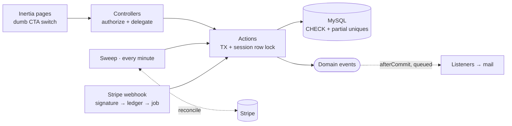
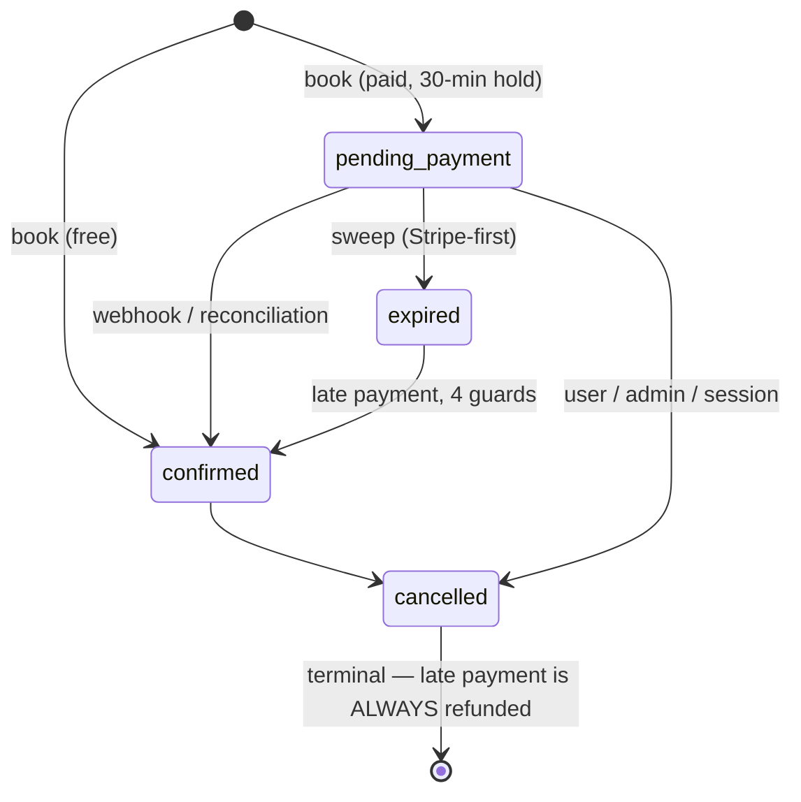

# Class Booking Platform — Laravel + Inertia + Vue

[](https://github.com/haefrain/class-booking-platform/actions/workflows/ci.yml)
[](LICENSE)


🇪🇸 [Versión en español](README.es.md)

A full-stack class booking platform for a studio/academy — recurring group classes with limited seats — built to show how a senior Laravel + Inertia codebase handles the parts of the booking domain that actually hurt: **seat concurrency without overbooking, a FIFO waitlist with atomic promotion, Stripe payments that survive every race, DST-safe recurrence, and queued reminders that fire at most once.** All of it under Pest, a real-lock concurrency suite, Larastan level 7, vue-tsc and CI against real MySQL.

## Stack

- **Laravel 13**, PHP 8.4 + **Inertia 3 / Vue 3 / TypeScript / Tailwind 4** (official starter kit, Wayfinder typed routes)
- **MySQL 8** · **Redis** (queues/cache) · **Mailpit** (dev mail) · **Stripe Checkout** (test mode, behind a gateway port)
- **Quality:** Pest (+ a dedicated two-connection concurrency suite), Larastan L7, Pint, ESLint/Prettier, Vitest, GitHub Actions

## The invariants — and the tests that prove them

The seat engine is defined by eight invariants, enforced three ways (actions under a row lock → DB constraints → a runtime auditor wired into `afterEach` and an hourly `integrity:check`). Reviewers can grep straight to the proof:

| # | Invariant | Proven by |
|---|---|---|
| I1 | `booked_count ≤ capacity`, always | `fires the database backstops even without the lock` (CHECK, errno 3819) |
| I2 | `booked_count` = live bookings, no drift | `SeatInvariantAuditor` in afterEach of every booking/payment/concurrency test |
| I3 | ≤ 1 active booking per user/session | `refuses a second active booking` + generated-column unique backstop |
| I4 | Never holding a seat AND waiting | auditor + `converts a waiting entry to left when the user books…` |
| I5 | Promotions strictly FIFO | `promotes a chain of cancellations strictly FIFO` |
| I6 | A waiter implies a full session | `never shows the seat free to a direct booker while a waiter is being promoted` |
| I7 | Deadline set ⟺ pending payment | auditor + `confirms the booking when the completed webhook arrives` |
| I8 | One refund max per payment | `refunds exactly once under double dispatch thanks to the atomic claim` |

The concurrency suite (`tests/Concurrency/`) uses **a second MySQL connection** and `FOR UPDATE NOWAIT` to prove the session-row lock is really held — plus a 50-operation interleaved property test asserting all invariants after every step. It runs in CI against the MySQL service container.

## Architecture





Key moves (each one is an [ADR](docs/adr/)):

- **One serialization point** — every seat mutation locks the session row; lock ordering is fixed; no network I/O inside transactions ([0001](docs/adr/0001-single-session-row-lock.md)).
- **Promotion inside the releasing transaction** — a freed seat is never observably free while someone waits ([0002](docs/adr/0002-promotion-inside-the-releasing-transaction.md)).
- **Sweep over delayed jobs, with reconciliation** — overdue holds expire Stripe-first; a paid-but-webhookless checkout gets confirmed locally from the source of truth ([0003](docs/adr/0003-sweep-with-reconciliation-over-delayed-jobs.md)).
- **Generated columns as partial uniques** — exactly one live booking per user/session with unlimited history, in MySQL ([0004](docs/adr/0004-generated-columns-as-partial-uniques.md)).
- **Hosted Checkout with a clamped `expires_at`** — Stripe's 30-minute floor vs. shorter local deadlines; the local deadline stays authoritative ([0005](docs/adr/0005-hosted-checkout-with-clamped-expiry.md)).
- **Weekly slots, no RRULE** — DST-safe expansion keyed on the LOCAL date, pinned by tests on the Madrid 2026 transitions ([0006](docs/adr/0006-weekly-slots-no-rrule.md)).

Money rules in one line each: late cancellation frees the seat but keeps the money (the dialog says so); payment-after-cancel always refunds, never resurrects; out-of-band refunds are flagged for the admin and never auto-cancel a seat; **money is never silently kept.**

## Quick start

```bash
cp .env.example .env
./vendor/bin/sail up -d            # MySQL 8 + Redis + Mailpit
./vendor/bin/sail artisan key:generate
./vendor/bin/sail artisan migrate --seed
./vendor/bin/sail npm install && ./vendor/bin/sail npm run build
```

App at `http://localhost:8082` · Mailpit at `http://localhost:8026`. Demo accounts (password `password`): `admin@` / `instructor@` / `student@classbooking.test`.

**The 60-second demo:** log in as the student → open *Guided Meditation* (full, 3-deep waitlist) → join it. As admin, cancel one of its bookings → watch the promotion mail land in Mailpit seconds later. Paid flow: book *Spinning*, pay with `4242 4242 4242 4242` (start webhooks with `sail up -d stripe` + your test keys), and watch the confirmation page flip on its own — then kill the forwarding and see the sweep reconcile the payment anyway.

## Production image

```bash
cp .env.production.example .env.production   # set APP_KEY, DB_PASSWORD, Stripe keys
docker compose -f compose.prod.yaml up -d --build
```

Multi-stage `Dockerfile` (composer `--no-dev` → Wayfinder+Vite build → `php:8.4-fpm-alpine` with opcache/JIT, non-root, ~210 MB, no `.env` or tests inside; the build runs `config:cache` to prove no config touches a dev-only class). Topology: nginx → app + **queue worker** (`critical,mail,default`) + **scheduler** (`schedule:work` is load-bearing: sweeps, reminders, heartbeat — the admin dashboard badge goes red if it dies).

## Runbooks

- **Changing the academy timezone:** update `ACADEMY_TIMEZONE`, then regenerate future sessions per schedule (booked ones must be cancelled explicitly). Reminders are unaffected (UTC math).
- **Refund failed:** admin → Payments → *Retry refund* (re-arms the atomic claim, same job).
- **Webhook outage:** nothing to do — the sweep reconciles paid checkouts; `integrity:check` alerts on stuck events.

## Out of scope (deliberately)

Ad-hoc one-off sessions, per-session instructor substitution, signed deep links in mails, memberships/subscriptions, SMS, multi-tenancy (a sibling portfolio project covers it: [laravel-saas-api](https://github.com/haefrain/laravel-saas-api)). All documented extension points, not accidents.

## Milestones

- [x] **B1** — Scaffold, Sail, roles, tooling, CI
- [x] **B2** — Domain: class types, recurring schedules, DST-safe generation
- [x] **B3** — Booking engine + FIFO waitlist, real-lock concurrency suite
- [x] **B4** — Stripe test-mode: checkout, webhooks, refunds, races
- [x] **B5** — Queued reminders, scheduler heartbeat
- [x] **B6** — Complete UI for the three roles
- [x] **B7** — Production image, ADRs & architecture docs

## License

[MIT](LICENSE) © Efraín Hernández
